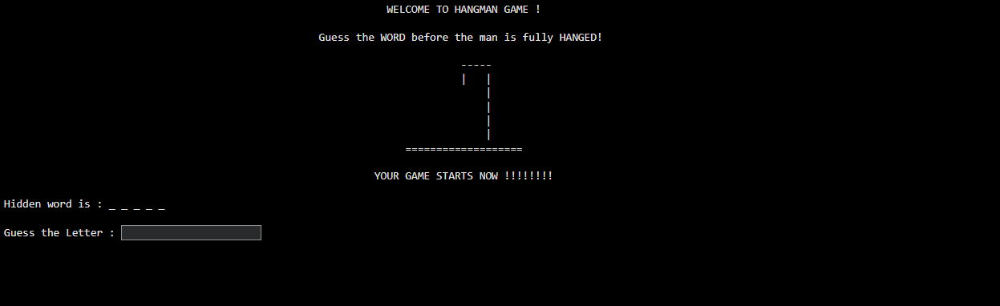
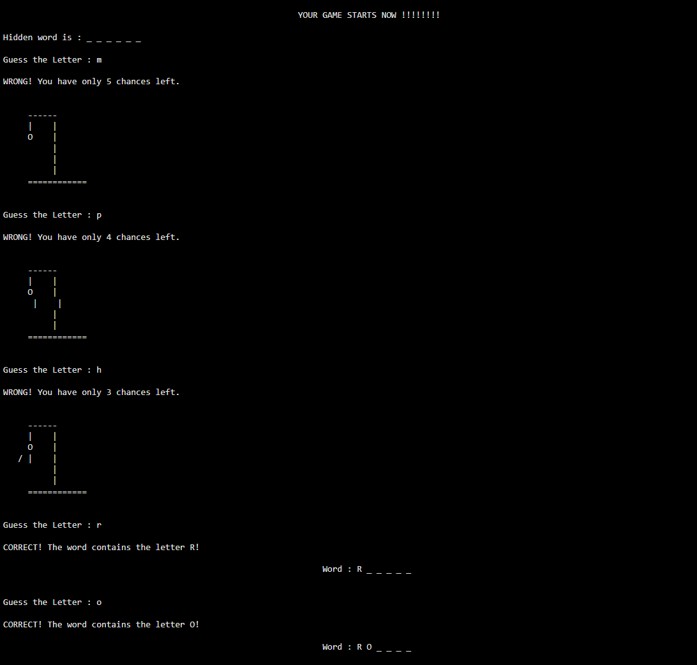
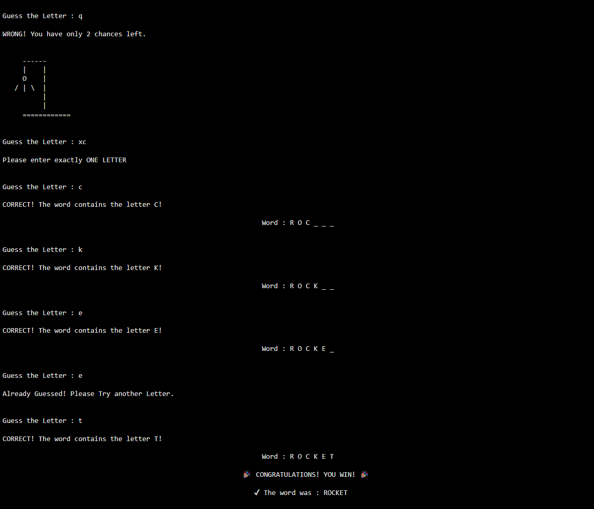
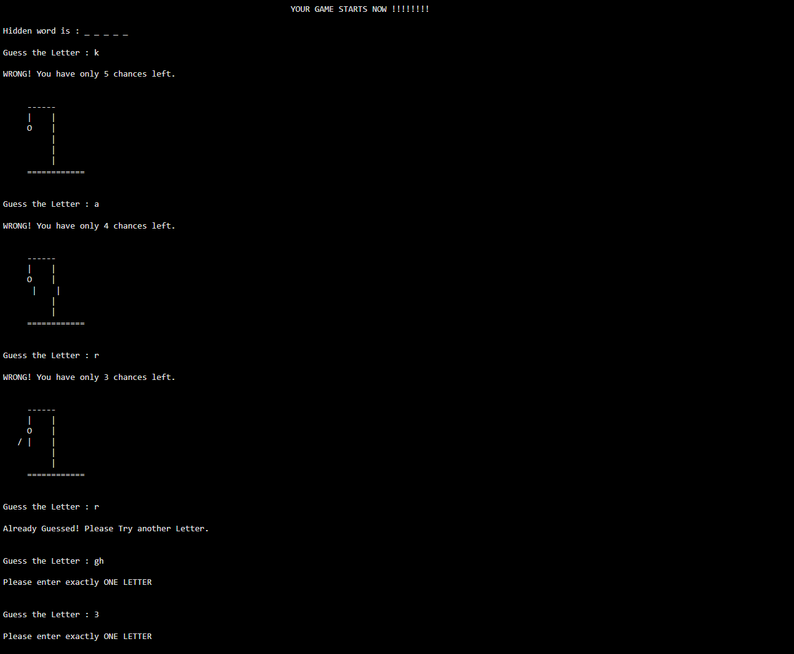
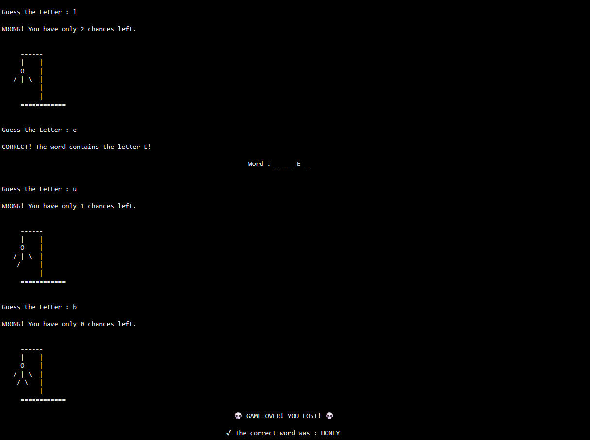

# 🎯 Hangman Game – Python Console Application

A classic **Hangman word guessing game** built in Python with random word selection, input validation, and ASCII-based visual feedback.

This project demonstrates core programming fundamentals including loops, conditionals, list manipulation, and user input handling in a structured game environment.

---

## 🎯 Project Overview

This project implements a terminal-based Hangman game where the player must guess a hidden word one letter at a time before the hangman drawing is completed.

The game uses **random word selection**, **state tracking**, and **ASCII visualization** to create an interactive and engaging command-line experience.

Key focus areas:
- Logical problem solving
- Clean control flow
- User input validation
- Game state management

---

## 🎮 Features

- 🎲 Random word selection for each game session  
- 🔤 Letter-by-letter guessing system  
- ❌ Tracking of correct and incorrect guesses  
- 🧠 Input validation (only single alphabet letters allowed)  
- 🔁 Prevention of repeated guesses  
- 🎨 ASCII art hangman stages  
- 🏆 Win/Lose condition handling  
- 💻 Fully terminal-based interactive gameplay  

---

## 🛠️ Technologies Used

**Programming Language:**
- Python 3

**Core Concepts:**
- Loops (while, for)
- Conditional statements (if-else)
- Lists and strings
- Basic game logic design
- Random module

**Library Used:**
- random (for word selection)

---

## 📁 Project Structure

```text
📦 python-hangman-game/
│
├── 📂 notebook/
│   └── 📓 Hangman_game.ipynb
│
├── 📂 screenshots/
│   ├── 📸 start.png
│   ├── 📂 win/
│   │   ├── 📸 1.png 
│   │   └── 📸 2.png
│   ├── 📂 loss/
│   │   ├── 📸 1.png
│   │   └── 📸 2.png
|
└── 📜 README.md
```
--- 
## 🎨 Visualisation

The game uses **ASCII art** to visually represent the Hangman progression in the terminal.

Each incorrect guess updates the hangman drawing step-by-step, providing clear feedback on remaining attempts.


       ------
       |    |
       O    |
     / | \  |
      / \   |
            |
     ==============  

---

## 📸 Screenshots

### 🎮 Start Screen


---

### 🎉 Win Scenario

#### Stage 1


#### Stage 2


---

### 💀 Loss Scenario

#### Stage 1


#### Stage 2


---


## ▶️ Open in Google Colab

👉 [Open Notebook in Colab](https://colab.research.google.com/github/keertikamanikandan-lab/python-hangman-game/blob/main/Hangman_game.ipynb)


## 🔗 GitHub Repository

🔗 [View GitHub Repository](https://github.com/keertikamanikandan-lab/python-hangman-game)

---

## 🚀 How to Run the Project

1. Download or clone this repository:

```bash
git clone https://github.com/keertikamanikandan-lab/python-hangman-game.git
```

2. Open the project folder.

3. Open `Hangman_game.ipynb` in:
- Google Colab (recommended)
- Jupyter Notebook

4. Run all cells to start the game.

---

## 🎮 How to Play
1. A random word is selected at the start of the game
2. The player guesses one letter at a time
3. Correct guesses reveal letters in the word
4. Incorrect guesses reduce remaining attempts
5. The game ends when:
- ✔ The word is fully guessed → You win
- ❌ Lives reach 0 → You lose
  
---

## 🧾 Conclusion

This project demonstrates a fully functional command-line Hangman game built using Python, focusing on core programming concepts such as loops, conditionals, lists, and input handling.

It showcases the ability to design structured logic, manage state effectively, and build an interactive application from scratch.

Overall, this project strengthens foundational programming skills and serves as a base for more advanced applications such as GUI-based or web-based games.


